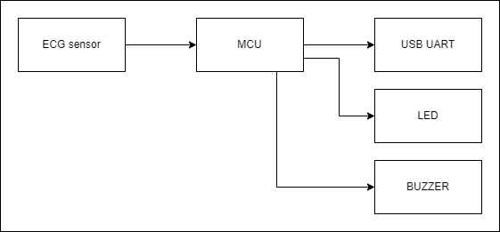
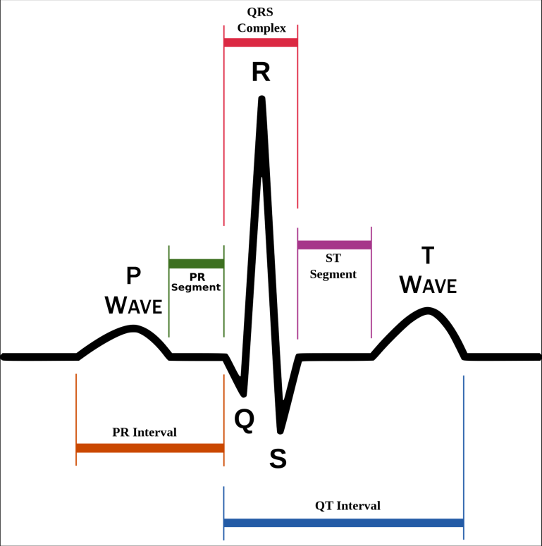
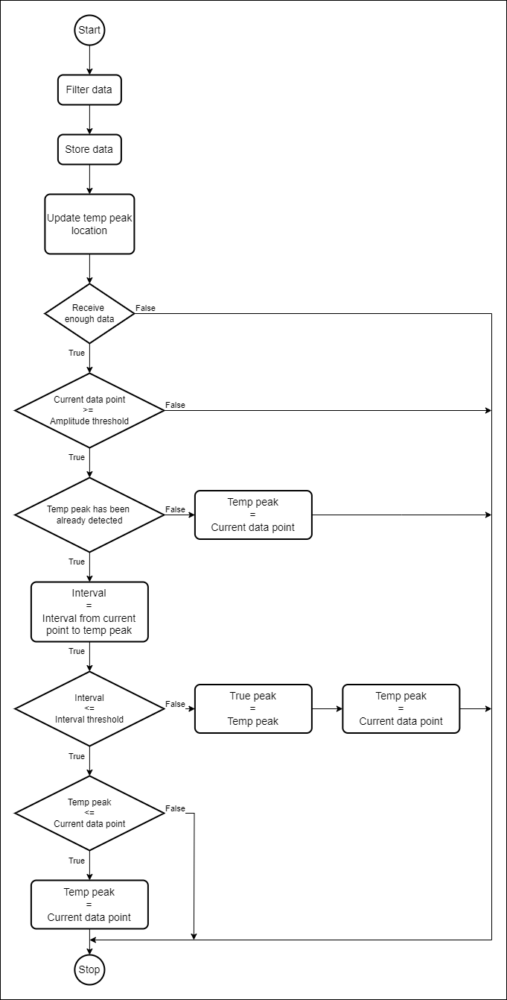
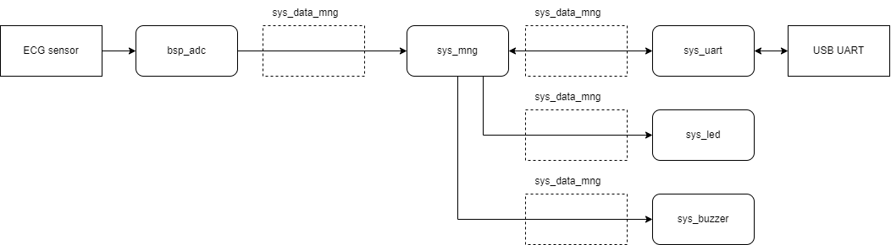
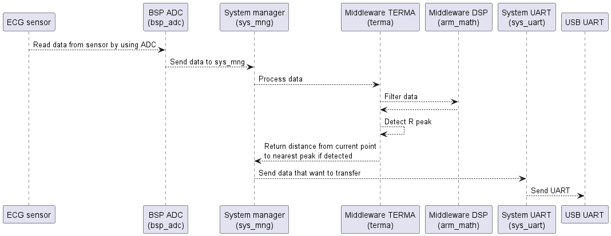
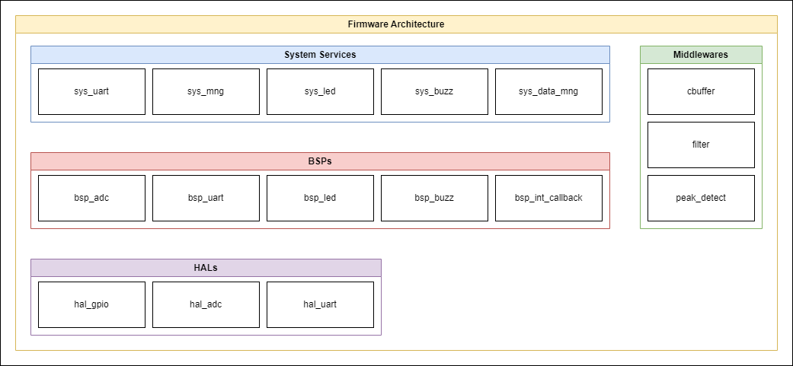
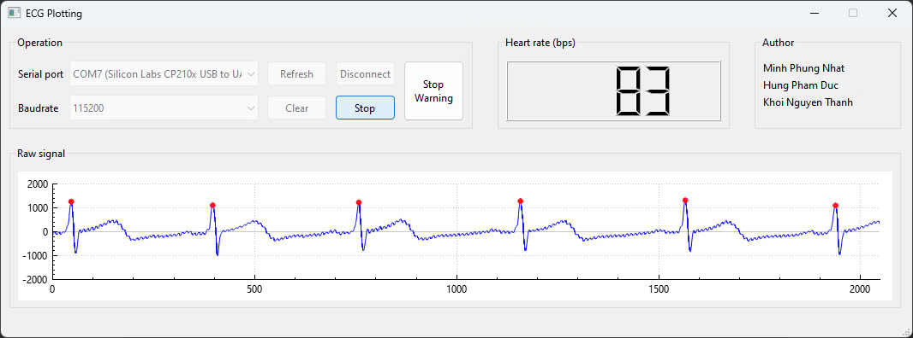

# **ECG Monitor**

## **1. Purpose**

The purpose of the ECG Monitor project is to provide a reliable and accurate tool for monitoring heart activity. Designed to help users keep track of their heart health, this device offers precise ECG readings and real-time heart rate measurements. By enabling users to monitor their heart activity regularly, the ECG Monitor fosters a proactive approach to heart health, promoting greater awareness and early detection of potential issues.

## **2. Features**

The SmartDeskClock project includes the following features:

1. **ECG Reading + Digital Filtering:** Utilizes advanced sensors and digital filtering to deliver precise and consistent electrocardiogram readings.

2. **Pulse Output to GUI:** Displays real-time ECG waveforms on a graphical user interface for easy monitoring and analysis.

3. **Heart Rate Measurement:** Measures and displays the heart rate based on ECG data.

4. **Alerts for High or Low Heart Rate:**: Provides alerts through LED indicators and a buzzer if the heart rate exceeds or falls below thresholds.

**Note:** This product is only used for people who do not have heart problems that changes the ECG normal shape.

## **3. Technical Requirements**

### **3.1. Hardware Requirement**

**Required Modules**
| Block      | Module                                        | Functionality                                                 |
| ---------- | --------------------------------------------- | ------------------------------------------------------------- |
| MCU        | STM32F411VET6                                 | Main microcontroller for the ECG Monitor                      |
| ECG Sensor | DFRobot Gravity: Analog ECG Heart Rate Sensor | Sensor for reading ECG and heart rate data **(Fmax = 150Hz)** |
| USB_UART   | CP2102 Mini                                   | USB to UART bridge for communication                          |
| LED        | LED                                           | Status indicator lights for the ECG Monitor                   |
| Buzzer     | Buzzer                                        | For sound notifications                                       |

**Hardware block diagram**

### **3.2. Firmware Requirement**

#### **3.2.1. Detail about Feature ECG Processing**

**Overview:**

| ID  | Functionality                  | Note                                                                                |
| --- | ------------------------------ | ----------------------------------------------------------------------------------- |
| 01  | Read ECG Signals               | Continuously read ECG signals from the ECG sensor by using ADC                      |
| 02  | Apply Digital Filtering        | Apply digital filters (Butterworth Filter) to remove noise                          |
| 03  | Detect Peaks                   | Detect location of R peaks                                                          |
| 04  | Measure Heart Rate             | Accurately measure heart rate based on R peaks location                             |
| 05  | Send data to laptop/PC         | Send data laptop/PC through UART, sending frequency is equal to sampling frequency  |

**Read ECG signal:**

Using ADC peripheral:
- ADC clock (f_ADC): 30MHz.
- Resolution: 12 bit - 15 ADC clock cycles for ADC conversion and synchronization.
- Sampling Time: 480 ADC clock cycles

=> Total Time for 1 time conversion: (15 + 480) / (f_ADC) =  (15 + 480) / (30000000) = 16.5 (us) 

- Max frequency of ECG sensor is 150Hz

  => Sampling frequency (fs) > 300Hz

  => Choosing fs = 500Hz. 

**Digital Filter:**

Use Butterworth Filter:
  - Gain: 1dB
  - Band-pass frequency: 0.05Hz - 150Hz.

**Detect Peaks:**

Below image is a normal ECG beat, peak detection algorithm aims to detect location of R peaks in the big sequent signal:

Below flowchart illustrate peak detection algorithm, this process is called every time ADC complete collect 1 data:

**Protocol:**
| **Field name**   | _TYPE_ | _LEN_ | _IS_R_PEAK_ | _DATA_ | _HEART_RATE_ |
|------------------|:------:|:-----:|:-----------:|:------:|:------------:|
| **Size (bit)**   |    8   |   8   |      1      |   15   |       8      |
| **Total Size**   | 5 (bytes)                                        |||||

- ***_TYPE_:*** Type of message.

| **TYPE** |                    | _LEN_ |
|:--------:|--------------------|:-----:|
| 0x00     | data               |   3   |
| 0x01     | start_getting_data |   0   |
| 0x02     | stop_getting_data  |   0   |
| 0x03     | stop_warning       |   0   |

- ***_LEN_:*** Size of data after LEN byte.

- ***_IS_R_PEAK_:*** Distance from current data point to the nearest R peak.

- ***_DATA_:*** Current data point value.

- ***_HEART_RATE_:*** Current heart rate.

UART is used to transfer data, baud rate is 115200

=> Total time to transfer 1 frame = 7 * 10 / 115200 = 607(us).

### **3.2.2. Firmware Data Flow**

### **3.2.3. Firmware Sequence Diagram**

### **3.2.4 Firmware Architecture**

### **3.3. Alerts for High or Low Heart Rate**

| ID  | Functionality                | Note                                                                        |
| --- | ---------------------------- | --------------------------------------------------------------------------- |
| 01  | High Heart Rate Alert        | Trigger LED and buzzer alerts if the heart rate exceeds a set threshold     |

### **3.4. Pulse Output to GUI**

| ID  | Functionality                | Note                                                                                         |
| --- | ---------------------------- | -------------------------------------------------------------------------------------------- |
| 01  | Send data to laptop/PC       | Send data to laptop/PC using UART                                                            |
| 02  | Real-Time Data Display       | Display real-time ECG data on a graphical user interface                                     |

GUI overview:

## **4. Developer Team**
1. **Minh Phung Nhat**
2. **Hung Pham Duc**
3. **Khoi Nguyen Thanh**